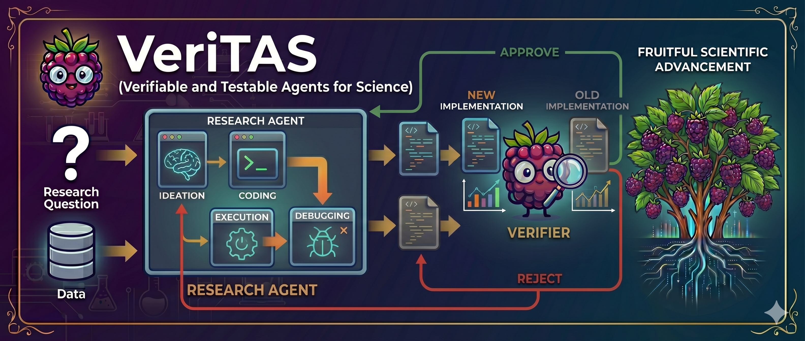

[](https://docs.python.org/3.10/)
[](LICENSE)
[](#project-status)
[](https://github.com/yunx-z/MLRC-Bench)

**Verifiable and Testable Agents for Science**

> The project name and expansion are a work in progress.

Make your automated research more fruitful through better verification.

VeriTAS extends [MLRC-Bench](https://github.com/yunx-z/MLRC-Bench) to add better formal verification to its iterative machine-learning research agent. MLRC-Bench provides objectively scored research-competition tasks; see the original paper, [*MLRC-Bench: Can Language Agents Solve Machine Learning Research Challenges?*](https://arxiv.org/abs/2504.09702), for the benchmark design and evaluation protocol.

In addition to the existing MLRC-Bench scorers, VeriTAS introduces a **Verifier**. The Verifier uses Bayesian statistics to estimate the additional information contributed by the most recent agent iteration and uses that estimate as an additional score.

> TODO: Replace the description above with a precise definition of “additional information,” including the Bayesian model, prior, posterior quantity, and decision rule used by the Verifier.

## Validation strategy

The Verifier will be evaluated through a paired ablation study:

1. Run MLRC-Bench with the Verifier disabled.
2. Repeat the run with the Verifier enabled.
3. Keep the LLM, task, prompt, data split, iteration and token budgets, random seed, and hardware configuration fixed across the pair.
4. Compare the resulting MLRC-Bench scores.

For each paired run, the net improvement is:

> TODO: How this score is derived has not been actually determined.

```text
net improvement = score_with_verifier - score_without_verifier
```

Results should be reported per task and in aggregate across repeated seeds. A positive paired difference indicates that adding the Verifier improved benchmark performance under the controlled configuration.

## Project status

VeriTAS is under active development. The commands below describe the intended project interface; the package, launch scripts, and tests still need to be added to this branch.

## Requirements

- [Conda](https://docs.conda.io/projects/conda/en/latest/user-guide/install/index.html) or Miniconda
- Python 3.10
- Git
- Hardware required by the selected MLRC-Bench task
- Credentials required by the selected model provider
- For applicable tasks, Kaggle API credentials and acceptance of the competition rules

# Installation

0.0. If you are part of our hackathon team, you will need access to our virtual machine. Follow the steps [here](docs/dev/GOOGLE_CLOUD.md)

0.1. Cloning Repos
    1.1.0 Install this repo:

    ```bash
    # https
    git clone https://github.com/MLSS-2026-VeriTAS/VeriTAS.git
    # ssh
    git clone git@github.com:MLSS-2026-VeriTAS/VeriTAS.git
    ```

    1.1.1 Install MLRC-Bench:

    ```bash
    # https
    git clone https://github.com/yunx-z/MLRC-Bench 
    # ssh
    git clone git@github.com:yunx-z/MLRC-Bench.git 
    ```

0.2. Create a Python environment

    ```bash

    conda create --name mlab python=3.10 -y # Name matters here
    conda activate mlab

    # Install MLRC Bench
    cd MLRC-Bench
    pip install -e .

    # resolves install issues in original MLRC Bench
    cd ../VeriTAS
    bash install_fixed.sh
    ```

# SETUP

1.0. (Optional) To run code in the background, a tmux session is recommended:

    ```bash
    # new session
    tmux new -s veritas_session

    # existing session
    tmux a -t veritas_session
    ```

**NOTE:** Make sure to reactivate conda

    ```bash
    conda activate veritas
    ```

1.1. Set the credentials required by the chosen model provider. For example, MLRC-Bench's OpenAI/Azure integration expects:

    ```bash
    export MY_OPENAI_API_KEY=<api-key>
    export MY_AZURE_OPENAI_ENDPOINT=<azure-endpoint>
    ```

> TODO: This key structure is an example and likely will need alteration.

# TASK-SPECIFIC SETUP

2.0. Assign Environment Variables Expected by MLRC Bench

    ```bash
    TASK_NAME=<task-name>
    MODEL=<model-name> # SEE https://github.com/yunx-z/MLRC-Bench/blob/main/MLAgentBench/LLM.py#L13 for list of model string options
    GPU_ID=<gpu-id> # 0
    TASK_NAME=<arbitrary-label-for-tracking-current-run>
    ```

2.1. Create Task-Specific Env

    ```bash
    cd ../MLRC-Bench/MLAgentBench/benchmarks_base/${TASK_NAME}/scripts
    conda env create -f environment.yml --name ${TASK_NAME} # name matters here
    conda activate ${TASK_NAME}

    # Install MLRC Bench
    cd ../../../..
    pip install -e .

    # install fixed installation script
    cd ../VeriTAS
    bash install_fixed.sh
    ```

2.2. Initialize env

    ```bash
    cd ../MLRC-Bench
    # Unsure why this is needed since it is not reflected in the MLRC docs
    bash scripts/init_env.sh "${TASK_NAME}" "${MODEL}" "${GPU_ID}" "${TASK_NAME}"
    ```

2.3. Launch Task

    ```bash
    # run the code
    bash launch.sh "${TASK_NAME}" "${MODEL}" "${GPU_ID}"
    ```

**NOTE:** Logs are output to a file, so you will need to copy the log directory that is output, exit tmux session (Ctrl-B, D), and view it (cat < LOG-DIR >)


> TODO: Document the final configuration option or command-line flag used to enable and disable the Verifier.

Refer to the [MLRC-Bench task documentation](https://github.com/yunx-z/MLRC-Bench#tasks) for supported tasks, models, dataset preparation, and task-specific requirements.

## Running the test suite

From the repository root with the `veritas` environment active, run:

```bash
python -m pytest
```

To run only the Verifier tests:

```bash
python -m pytest tests/test_verifier.py
```

## Running the validation test

The validation runner should execute matched runs with and without the Verifier, then report the paired score differences. The planned interface is:

```bash
python scripts/validate_verifier.py \
  --task <task-name> \
  --model <model-name> \
  --gpu-id <gpu-id> \
  --seeds 0 1 2 3 4 \
  --compare-verifier
```

> TODO: Implement the validation runner and update this command if its final interface differs.

At minimum, validation output should include:

- The task, LLM, seed, and run configuration.
- MLRC-Bench scores with and without the Verifier.
- The paired net improvement for every run.
- Aggregate mean improvement and uncertainty across seeds.
- Runtime and model/API cost, so gains can be interpreted alongside overhead.

## Contributing

Contributions are welcome. Please keep changes focused, add or update tests, and document any changes to the experiment protocol that could affect reproducibility.

Developer notes live in [`docs/dev/`](docs/dev/README.md).

## License

VeriTAS is available under the [MIT License](LICENSE).
